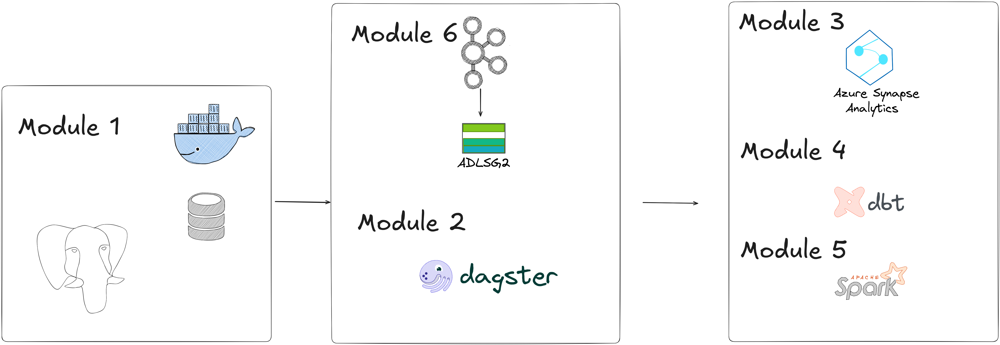

# Data Engineering
This repo is for learning data engineering via the Data Engineering ZoomCamp. There are several modifications that I am going to make:
1. For the workflow orchestration, I will be using Dagster instead of Prefect/Mage since i prefer using it 
2. For the data warehouse, I will be using Azure Synapse instead. This is due to me working with the Azure stack at my day job. I have my private Azure account where I am free to work with it
3. For versioning and data control, I will be implementing Delta Lake and LakeFS. This will allow for easy rollbacks for the data.
3. For the repo, I will be doing it directly on GitHub instead of Azure DevOps. This is to reduce the cost for me for my private Azure. 

# Architecture

# Task
To build a working data engineering pipeline based on Dagster, DBT, lakefs and containerize and deploy using AKS. We will use the ADLSG2 as the database.

